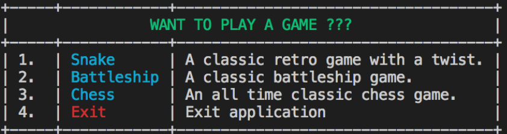
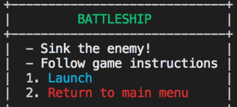
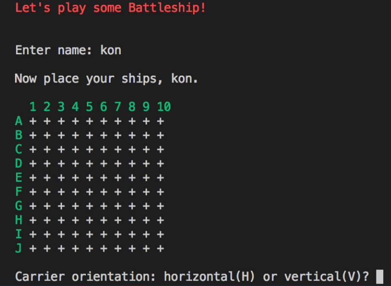

# **Retro Games**
*~ by Konstantinos Pitsakis & Barbara Rodriguez ~*


## **Idea**
***
Our idea arose from our common interest in video games - classic/retro games to be exact. 

We then began to breakdown our ideas to achieve a simple - yet *viable* - product which a user can enjoy in their own in-built terminal.

We decided to name our application "**RETRO GAMES**".


--> **Methods & Gems** <---

To show our understanding of the content presented to us, we planned to utilize various methods/functions and gems (*retrieved from [Ruby Gems](https://rubygems.org)*) in our application. 


## **Design**
***

Below are the steps required to launch **Retro Games** within the terminal.


**STEPS:**

1. Launch terminal => type "*ruby main.rb*"
```terminal
ruby main.rb
```
2. Main menu will initiate, and the following options are available for the user to choose from.

> 


3. For example, if you were to select "**2**" from the main menu, the game "**Battleship**" will launch.

    The following game menu will appear:
> 

4. The game is initiated! Enjoy!

> 

## **Resources**

**Gem files**
> [Snake Game](https://github.com/josem/snake_game)

> [Battleship](https://github.com/rodriguezd/ruby_battleship)

> [Terminal_chess](https://github.com/at1as/Terminal-Chess)

> [Terminal-table](https://github.com/tj/terminal-table)

> [Colorize](https://github.com/fazibear/colorize)

